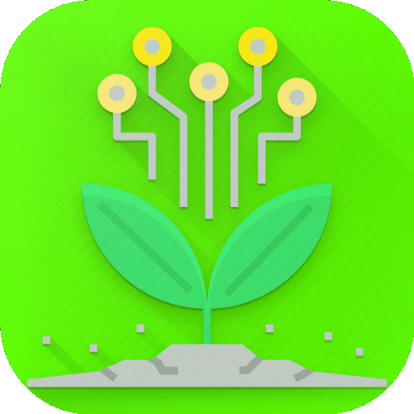
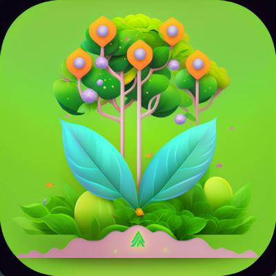

# Farmassist Overview

  
  <b> ====migration====> </b>
  

## Introduction

Farmassist is a cutting-edge smart farming solution designed to revolutionize agriculture by leveraging technology to optimize crop management, increase yields, and improve efficiency. With its comprehensive suite of features, Farmassist empowers farmers, agricultural enterprises, and researchers to make data-driven decisions and achieve sustainable agricultural practices.

## Key Features

### Streamlined Farm Management

- Easily track planting and harvesting data.
- Access valuable agricultural news updates.
- Make informed decisions about crops based on real-time insights.

### Real-Time Sensor Monitoring

- Gain valuable insights into environmental conditions.
- Monitor air humidity, soil moisture, temperature, pH, and salinity in real-time.
- Receive alerts for abnormal sensor readings.

### AI-Powered Plant Disease

- Capture images of diseased plants and receive potential disease type suggestions.
- Utilize both online and offline modes for disease detection.
- Improve disease management and minimize crop losses.

### Predictive Farm Management (Future Implementation)

- Optimize planting and harvesting schedules.
- Maximize agricultural yield with predictive analytics.
- Improve operational efficiency and resource utilization.

## Architecture

Farmassist is built upon a robust foundation of modern technologies, including cloud services and mobile app development frameworks. The architecture consists of multiple subsystems:

- **Farm Management Subsystem:** Utilizes Cloud Firestore for efficient data storage and management. Integrates with external APIs for news updates and weather data.
- **IoT Monitoring Subsystem:** Employs Firebase Realtime Database for real-time sensor data collection. Utilizes Cloud Functions for abnormality detection and push notifications.
- **Plant Disease Detection Subsystem:** Implements both offline and online modes for disease detection using AI models and cloud-based image recognition APIs.

## Benefits

- Increase agricultural productivity and yield.
- Reduce resource wastage and environmental impact.
- Improve decision-making with real-time insights.
- Enhance disease management and crop health.
- Enable sustainable agricultural practices.

## Getting Started

To start using Farmassist, simply sign up for an account on our platform or download the mobile app from the app store. Our intuitive interface and user-friendly design make it easy to get started and access the full range of features.

## Conclusion

Farmassist is your trusted partner in modernizing agriculture and achieving sustainable farming practices. With its advanced technology and comprehensive features, Farmassist empowers farmers and agricultural enterprises to thrive in today's competitive agricultural landscape. Join us on the journey towards a more efficient, productive, and sustainable future for agriculture with Farmassist.

>**NOTE:** You can access the page online through [Farmassist documentation](https://farmassist-doc.netlify.app/).
